# Segmented Security Homelab

## Architecture
- **Host**: VMware Workstation Pro on Windows PC (All-Black Build)
- **Networking**: Dual-NIC (2-port add-on card) + TP-Link Deco BE63 (Wi-Fi 7)
- **Local AI Infrastructure**: Docker-based environment running Ollama (LLM) and ComfyUI (Generative AI) for research and creative automation.
- **Firewall**: pfSense VM acting as a virtualized security gateway and router-on-a-stick.
- **VNet1 (Defensive/Corp - VMnet2)**: Windows Server 2022 (AD, DHCP, DNS), Windows 10 Client, Ubuntu 22.04 Client, Fedora Headless (Web Server).
- **VNet2 (Offensive/Isolated - VMnet3)**: Kali Linux, basic_pentesting_1, OWASP Broken Web Apps v1.2.

## Security Controls
- **Micro-segmentation**: pfSense firewall rules strictly block VNet2 (Attack Zone) from initiating traffic to VNet1 (Safe Zone).
- **Traffic Isolation**: VNet1 is configured to log attempts but is logically isolated from the research lab.
- **Egress Filtering**: All outbound internet traffic passes through pfSense with granular logging and inspection enabled.

## What I Practice Here
- **Blue Team**: Active Directory hardening, Group Policy management, log analysis, and system defense.
- **Red Team**: Web application penetration testing (OWASP Top 10), network enumeration, and privilege escalation.
- **Network Engineering**: pfSense rule logic, virtual switching (VMnet management), and Internal DNS/Web serving.

## Diagram

Click to view/edit raw Mermaid source code

flowchart TD
    %% Global Styles
    classDef hardware fill:#1a1a1a,stroke:#555,stroke-width:3px,color:#fff,font-size:20px,font-weight:bold
    classDef pfSense fill:#b30000,stroke:#333,stroke-width:2px,color:#fff,font-size:18px,font-weight:bold
    classDef safe fill:#004d99,stroke:#fff,stroke-width:1px,color:#fff,font-size:16px
    classDef attack fill:#660000,stroke:#fff,stroke-width:1px,color:#fff,font-size:16px
    classDef ai fill:#4b0082,stroke:#fff,stroke-width:1px,color:#fff,font-size:16px

    Internet((Internet)) --- ISP[ISP Gateway]
    ISP --- BE63[TP-Link Deco BE63 Wi-Fi 7]
    BE63 --- PC_Host[fa:fa-desktop Physical PC Host Enterprise Infrastructure]
    class PC_Host hardware

    subgraph Host_Level [Local AI & Containers]
        direction LR
        Docker[fa:fa-docker Docker Engine]
        Ollama[Ollama LLM]
        Comfy[ComfyUI]
        Docker --- Ollama
        Docker --- Comfy
    end
    class Host_Level ai
    PC_Host --- Host_Level

    subgraph VMware_Workstation [<h1>VMware Workstation Pro</h1>]
        direction TB
        pfSense[fa:fa-shield pfSense Firewall]
        class pfSense pfSense

        VMnet0[VMnet0: Bridged WAN]
        
        %% ALIGNED TERMINOLOGY
        VMnet2[VNet 1: Internal Safe Zone - VMnet2]
        VMnet3[VNet 2: Isolated Attack Lab - VMnet3]

        PC_Host --- VMnet0 --- pfSense

        subgraph Safe_Zone [VNet 1: Safe Production - VMnet2]
            direction TB
            DC[Win 2022 DC]
            W10[Win 10 Client]
            Fedora[Fedora Web Server]
            DC -.-> |DNS| Fedora
        end
        class Safe_Zone safe

        subgraph Attack_Zone [VNet 2: Security Lab - VMnet3]
            direction TB
            Kali[Kali Linux]
            OWASP[OWASP BWA]
            Pentest[basic_pentesting_1]
            Kali --- OWASP
        end
        class Attack_Zone attack

        pfSense --- VMnet2
        pfSense --- VMnet3
    end

## Documentation
Detailed step-by-step build notes for the pfSense gateway, Active Directory promotion, and client integration can be found in the [docs/BUILD_NOTES.md](./docs/BUILD_NOTES.md) file.